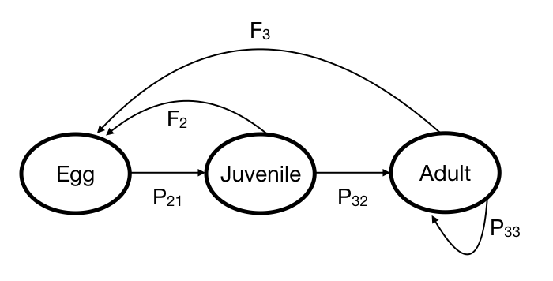

```{r setup, include=FALSE}
knitr::opts_chunk$set(echo = TRUE)
options(dplyr.summarise.inform = FALSE)
require(dplyr)
require(ggplot2)
require(tidyverse)
```

In this notebook, we will cover

* population projections using matrix notation
* a simple projection example in *R*
* relevant background readings (shown in bold below)
* exercises to introduce topics that will be covered during the workshop

We will focus on a simple example based on the **cohort-component projection method**.  
For a refresher on this method, you can refer to **Preston *et al.* (2001), Section 6.3** and/or **Wachter (2014), Chapter 5**.   
If you are unfamiliar with using R for matrix algebra, check out **Appendix A**, where we walk through the basics.

### Introduction

Demographers are often interested in understanding how a population will change over time.
For example, given information about a population today -- its size, fertility rates, and death rates -- we might want
to know how much growth or decline we can expect to see in the coming years.
The **cohort-component projection method** can be used to help answer this question.
The idea is to divide the population into subgroups that are homogenous in the sense that that population members 
within each subgroup experience similar mortality and fertility rates.
In human populations, death rates and fertility rates are strongly related to age, and so human demographers
most often use age groups. But the method can also work with other groupings; for example, population biologists
often model life histories of other species using 'life stages' rather than chronological age.

Given some simplifying assumptions (more in a moment), projecting a population forward in time using the cohort-component method requires two main pieces of information:

1. the survivorship ratio or the probability that the members of each age group will survive into the next time period, and 
2. the number of births that will occur and then survive until the next time period. 

The mechanics of cohort-component projection methods can be elegantly and concisely represented using matrices. Matrix algebra simplifies computation, and it allows demographers to take advantage of insights from linear algebra to establish important relationships that describe the fundamental dynamics of a population. We will see this in action on the first day of the workshop when we discuss stable population theory. 

Now, what about those assumptions? To keep things tractable, we'll make three big assumptions here:

1. we will assume there is no migration, so that all population change comes from births or deaths
2. we will focus entirely on females to avoid the complexity of modeling reproduction with two sexes
3. we will assume that birth rates and death rates are fixed (i.e., they do not change over time)

These assumptions are commonly made in practice. When necessary, they can all be relaxed -- but that
makes things more complex. In this introduction, our goal is to keep things as simple as possible.

### A simple projection example using a fish population 

Let's look at a simple projection example. Imagine an age-structured fish population at a given point in time.
In a given year, the population can change in two ways: fish can survive (or die), and they can produce eggs.

The fish population is divided into three age groups (or 'stages'): egg stage (up to age 1), juvenile stage (age 1), and an adult stage (age 2 and above). 
Note that this last stage is open-ended; that is, adults alive in one year can survive to remain adults in the next year.

Our goal is to use the cohort-component projection method to figure out:

1. How many fish we expect to be alive 10 years from now, and 
2. How many fish we expect to be in each age group 10 years from now

Since our age groups are one year wide (apart from the open-ended age group), we
will project using a discrete time step of one year. If we can develop a way to
project the population forward one year, then we can repeat this process 10
times to predict the answer to our two questions.

#### The lifecycle diagram

It is helpful to visualize a structured population like this one using a *lifecycle diagram*: 

```{r pressure, echo=FALSE, out.width = '60%'}

```


In the lifecycle diagram, each age group is represented by a node, and arrows are used to show how members of 
one age group contribute to the number of future members in other age groups.
(Here, future means 'one time step later'.)
For example, look at juveniles in the diagram above. 
In a given year, juveniles can survive to become adults in the next year, so there is
an arrow from the juvenile group to the adult group.
Juveniles can also produce eggs, so there is an arrow from the juvenile group to the egg group.
And, since eggs alive in one year can survive to become juveniles in the next year,
there is an arrow from the egg group to the juvenile group.

Note that not all possible arrows are drawn in the diagram.
For example, there is no arrow from the egg group to the adult group.
This encodes an assumption made by this model: it is assumed to be impossible for an egg to become an adult
in just one year.
Note also that there is no arrow from the juvenile age group to itself.
This encodes another assumption: all members of the juvenile age group in a given year
either die or survive to become adults; none remain juveniles in the next time period.


#### Some data 

The lifecycle diagram summarizes our assumptions about how members of each age group
can affect the future population.
In order to make an actual projection, we will need quantitative estimates associated with
each arrow. 

First, we need values that describe survivorship - i.e., the proportion of fish in each age group that survives to become members of the next age group one year later.
We assume that 30% of eggs survive to become juveniles in a year ($P_{21} = 0.3$), 50% of juveniles survive to become adults in a year ($P_{32} = 0.5$), and 20% of adults survive beyond a year ($P_{33} = 0.2$). 

Next, we need values that describe fertility.  We assume that juveniles and adults both produce eggs, but at different rates: each juvenile produces 5 eggs ($F_2 = 5$), and each adult produces 10 eggs ($F_3 = 10$). (Since we are assuming an all-female population, we assume these eggs are all female too.)

#### Projections using the lifecycle diagram

How does the lifecycle diagram relate to a population projection? 
Assuming we know (1) how many fish are in age group at a given point in time, say time 0; and, (2) we have quantitative estimates for all of the arrows in the lifecyle diagram, then we can
project the number of fish that will be in each age group one year later, at time 1.
To unpack this projection, we will focus on one age group at a time.

First, we'll consider the number of juveniles one year into the future. 
Look again at the life-cycle diagram and notice that there is only one arrow going into the juvenile stage. That tells us that the only way we can get juveniles in time period 1 is through the survival of eggs who are alive at time period 0. And the parameter associated with that
arrow, $P_{21}$, gives the proportion of eggs that survive to become juveniles. In other words,

$$
\begin{aligned}
\text{Number juveniles at time 1} = \text{Number of eggs at time 0} \times P_{21}.
\end{aligned}
$$

Turning now to adults, we find a slightly more complicated situation: the adults stage 
has two arrows pointing into it: one from the juvenile stage and one from itself.
The number of adults at time 1 will be given by

$$
\begin{aligned}
\text{Number adults at time 1} = (\text{Number of juveniles at time 0} \times P_{32}) + (\text{Number of adults at time 0} \times P_{33}).
\end{aligned}
$$

Finally, let's consider the number of eggs at time 1. Looking at the diagram, we see that
eggs at time 1 can come from juveniles or adults. We have

$$
\begin{aligned}
\text{Number eggs at time 1} = (\text{Number of juveniles at time 0} \times F_{2}) + (\text{Number of adults at time 0} \times F_{3}).
\end{aligned}
$$

Note that we are ignoring two important factors in our calculation for the number of eggs at time 1: we are assuming that (1) the fertility parameters $F_1$ and $F_2$ take into account the fact that not all juveniles and adults survive all the way through to time 1; and (2) that all of the eggs that are born during the projection interval survive until time 1. Of course, this is not perfectly realistic. **Wachter, Ch. 5** shows how to construct parameters that adjust for these important factors. But, for our purposes, making these two additional assumptions keeps keeps things nice and simple. 

#### The Leslie Matrix

Here is where the link to linear algebra starts to reveal itself.
We now have enough information to construct a **Leslie matrix**, which is used in demography and population biology to project forward an age- (or stage-) structured population using the cohort-component method.
If you are unfamilar with Leslie matrices, **Chapter 5 in Wachter (2014)** describes them in great detail.

The rows and columns of a Leslie matrix correspond to age groups; so, in this case there will be 3 rows and 3 columns (the Leslie matrix is always square).
The entries of the Leslie matrix tell us how the number of people in one age group contribute to the future number of people in another age group. 
Specifically, entry $a_{ij}$ of the Leslie matrix -- that is, the entry at row $i$, column $j$ -- tells us how many future members of age group $i$ there will be,
per current member of age group $j$. It might be helpful to think of there being an implied arrow, $a_{i \leftarrow j}$ to remember the order. 

From our data on the fish population, we can construct a Leslie matrix **A**:

$$A =\begin{bmatrix}
 0 & F_2 & F_3 \\
 P_{21} & 0 & 0 \\
 0 & P_{32} & P_{33}\\ 
 \end{bmatrix}  =\begin{bmatrix}
 0 & 5 & 10 \\
 0.3 & 0 & 0 \\
 0 & 0.5 &0.2 \\ 
 \end{bmatrix} $$
 
The entries of **A** are nonzero whenever there is an arrow from one age group to another in the lifecycle diagram.
For example, in row 2, column 1, $a_{12} = P_{21}$, the number of future juveniles per current egg, which we have assumed to be 0.3. 
On the other hand, when there is no arrow from one age group to another in the lifecycle diagram, there is a $0$ in the
corresponding entry of the Leslie matrix. For example, $a_{31} = 0$, since we have assumed that eggs cannot become adults in
one time step. Wachter calls entries like $a_{31}$ 'structural zeroes' in the Leslie matrix.

What's so valuable about the Leslie matrix is that it turns out that we can use it to reduce all of our reasoning in
the previous section to matrix multiplication. To see how, suppose that at time 0 we have $k_e(0)$ fish who are eggs,
$k_j(0)$ fish who are juveniles and $k_a(0)$ fish who are adults.
Write the number of population members at time 0
as a vector whose entries are the number of fish in each age group:

$$
K(0) =
\begin{bmatrix}
k_{e}(0)\\
k_{j}(0)\\
k_{a}(0)
\end{bmatrix}.
$$

Now notice that multiplying this vector by the Leslie matrix produces exactly the same
calculations for the future number of fish that we reasoned through in the previous section:

$$
A \cdot K(0) =
\begin{bmatrix}
 0 & F_2 & F_3 \\
 P_{21} & 0 & 0 \\
 0 & P_{32} & P_{33}\\ 
 \end{bmatrix}
\begin{bmatrix}
k_{e}(0)\\
k_{j}(0)\\
k_{a}(0)
\end{bmatrix}
=
\begin{bmatrix}
F_2~k_{j}(0) + F_3 k_a(0)\\
P_{21}~k_{e}(0)\\
P_{32}~k_j(0) + P_{33}~k_a(0)
\end{bmatrix}
=
\begin{bmatrix}
k_{e}(1)\\
k_{j}(1)\\
k_{a}(1)
\end{bmatrix}
= K(1).
$$

You might think of the Leslie matrix as simultaneously encoding the assumptions of the lifecycle diagram
with the quantitative estimates of the parameters of the lifecycle diagram.
Matrix multiplication by the Leslie matrix projects a population vector one time period forward.

If we are interested in projecting forward by more than one time period, we can simply apply the
Leslie matrix again:

$$
K(2) = A \cdot K(1) = A \cdot (A \cdot K(0)) = A^2 \cdot K(0).
$$
The projected population two years into the future is just the Leslie matrix applied to the
starting population twice - that is, the square of the Leslie matrix times the starting population.
(Note that here is where the assumption that fertility rates and death rates do not change over time
really kicks in.)

#### Exercises, Part 1

1. How would the lifecycle diagram above change if all fish who entered the adult stage died within a year? How would this change affect the Leslie matrix?
2. Draw a lifecycle diagram for a human population divided into 15-year age groups: 0-14, 15-29, 30-44, 45-59, 60-74, 75+.  You can use 15 year time steps and you can assume the population is all female. (Just draw the nodes and arrows; you don't need quantitative estimates for all of the arrows.) 

### A worked example

Having reviewed the conceptual idea behind population projection with Leslie matrices, let's
get more concrete and start to use `R` a little.
Suppose that we start with a fish population composed of 100 eggs, 250 juveniles, and 50 adults.
We can write this age distribution as a vector **K(0)** (where the 0 denotes time 0):

$$
K(0) =
\begin{bmatrix}
100\\
250\\
50
\end{bmatrix}
$$

And let's also create our Leslie matrix in `R`: 

```{r}
#Leslie Matrix
A <- matrix(c(0, 5, 10, 
              0.3, 0, 0, 
              0, 0.5, 0.2), 
            nr = 3, 
            byrow = TRUE)
A
```

Now we can project the fish population forward using:
\( \textbf{K(t+1)} = \textbf{A} \cdot \textbf{K (t)} \) where the initial population vector is \(\textbf{K (t)}\).

```{r}
# set up the intial population vector
K0 <- matrix(c(100,250,50), ncol = 1)

# project forward
K1 <- A %*% K0
K1
```

One year later, we project there will be ```r K1[1]``` eggs, ```r K1[2]``` juveniles, and ```r K1[3]``` adults.

Let's project the population over a longer time interval and see what happens.

```{r}
years <- 20
K.projected <- matrix(0, nrow = nrow(A), ncol = years+1)
K.projected[, 1] <- K0

for (i in 1:years)
{
	K.projected[, i + 1] <- A %*% K.projected[,i]
}

par(mfrow=c(1,2))
matplot(0:years, t(K.projected), type = "l", lty = 1:3, ylab = "K(t)", xlab = "Time (t)", xlim=)
legend("topleft", legend = c("Eggs", "Juvenile", "Adult"),lty = 1:3, col = 1:3, bty = "n")
matplot(0:years, log(t(K.projected)), type = "l", lty = 1:3, ylab = "log(K(t))", xlab = "Time (t)", xlim=)
legend("topleft", legend = c("Eggs", "Juvenile", "Adult"),lty = 1:3, col = 1:3, bty = "n")

```

Clearly, this is a growing population! Let's think about what's going on a little more in the
second set of exercises.

## Exercises, Part 2

1. How would you describe the trajectory of the total population over time? (Is it increasing linearly? Logarithmically? etc)
2. Does there appear to be a long-term equilibrium age structure and growth rate? If so, what are they? If not, how does the growth rate appear to change?
3. What happens to the age structure and growth rate if we start with a different initial population and age distribution?
4. What happens to the age structure and growth rate if multiply the 1st row by a constant like 2?
5. What happens to the age structure and growth rate if you change the survivorship parameters (i.e., the $P_{\cdot\cdot}$)? 

*Solutions and associated code provided in separate notebook.*

During the workshop, we will construct a Leslie matrix for projecting forward human populations. We will see the implications of a population exposed to the same age-specific mortality and fertility rates for a long time, and compare the results of our projection experiment with the growth rate and population structure implied by stable population theory. 

**Congratulations you have finished your pre-workshop notebook on population projections! Hopefully you learned something along the way, and it raised some questions that we can answer during the workshop.**

## Appendix A: Matrices in R

The aim of the exercises in this Appendix is to get everyone comfortable with handling matrices in R. This will be important for investigating population projection in the workshop. If you are already familiar with matrix manipulation in R, feel free to stop here. If not, please spend 15 minutes or so going through the material below. Play around with changing numbers, indices etc. to make sure you understand what is happening. 

### The matrix function

In R, A matrix is a two-dimensional array where each element has the same mode (numeric, character, or logical). The `matrix` function allows you to define a matrix, inputting some data and specifying the dimensions (through `ncol` and `nrow` arguments). 

By default, R wants the data to be entered by columns starting with column one. For example, to create a 4x4 matrix `A`:

```{r}
A <- matrix(data = 1:16, ncol = 4, nrow = 4)
A
```

You can look at various characteristics of the matrix `A` by using the following commands:

```{r, eval=FALSE}
is.matrix(A) # returns TRUE if A is a matrix
dim(A)  # returns a vector with dimensions of A (nrow, ncol)
ncol(A) # number of columns of A
nrow(A) # number of rows of A
```

Matrices can be subset by using square brackets and the row and/or column indices:

```{r, eval=FALSE}
A[2,1] # returns element in second row and first column 
A[,3] # returns third column
A[4,] # returns fourth row
```


We can also define an empty matrix using `NA`'s, and fill it in later with the aid of subsetting:

```{r}
# Define an empty matrix
K <- matrix(data = NA, ncol = 10, nrow = 4)
# filling in the first column with 1's:
K[,1] <- rep(1, times = nrow(K))
# filling in the remaining columns:
K[,2:ncol(K)] <- matrix(1:36, ncol = 9, nrow = 4) 
K
```

### Manipulating matrices

You can add, substract, multiply or divide each element of a matrix by a scalar, for example:

```{r, eval=FALSE}
A + 2 # adds 2 to every element
A * 8 # multiples every element by 8
```

For matrices that are the same dimension, you can do matrix addition and subtraction:

```{r}
B <- matrix(data = rep(1, 16), nrow = 4, ncol = 4)
A+B # add A and B element wise
```

There are some handy built-in matrix functions, for example:

```{r, eval = F}
colSums(A) # returns a vector of sums of each column of A
rowMeans(A) # returns a vector of means of each row of A
t(A) # transpose of A
diag(A) # returns a vector with just the diagonal elements of A
eigen(A) # returns a list eigenvalues and eignvectors of A
```


Provided the matrices are conformable, matrix multiplication is performed through the use of `%*%` function. Here, conformable means that the number of columns of the left matrix is the same as the number of rows of the right matrix.

```{r, eval = F}
A%*%B
# can also multiply by K, our 4 x 10 matrix from earlier
A%*%K
# but can't multiply by a 3 x 3 matrix, for example
C <- matrix(data = 1:9, ncol = 3, nrow = 3)
A%*%C # throws an error
```

NOTE: `A%*%B` is not the same as just using the `A*B`, which does the element-wise multiplication.

```{r, eval = F}
A%*%B
A*B
```

### For loops

For loops repetitively execute a statement or series of statements until a condition isn't true. Loops are useful because they save us from copy-pasting similar code over and over. 
```{r}
for(i in 1:10){
  print(paste("Hello, you are in loop number", i))
}
```

For example, if we wanted to obtain the difference between a column of a matrix and the previous column:
```{r}
Z <- matrix(data = c(rep(1, 3), rep(4, 3), rep(9, 3)), ncol = 3, nrow = 3) 
Z # so the difference matrix will be a column of 3's then a column of 5's


# initialize a difference matrix
diff.Z <- matrix(NA, nrow = nrow(Z), ncol = (ncol(Z)-1)) #there will only be two columns of differences

for(i in 1:(ncol(Z)-1)){
  diff.Z[,i] <- Z[,i+1] - Z[,i]
}
diff.Z
```


### Sequential matrix multiplication

When looking at population projection, we often want to do matrix multiplication on columns of a population matrix `K`, where each column of `K` depends on the previous column. We can do this in R using a combination of matrix multiplication and for-loops.

```{r}
# initialize a population vector with 4 age groups, and 10 time periods
K <- matrix(NA, ncol = 10, nrow = 4)
# fill in the first column, which is like our initial population
K[,1] <- rep(.1, times = 4)

# now fill in the remaining columns of K as the matrix multiplication of A and the previous column of K
# we do this using a for loop
for(i in 2:ncol(K)){ # for each column of K, starting at column 2
  K[,i] <- A%*%K[,i-1] # this column of K is equal to A multiplied by the previous column of K
}
K
```

The meaning of `A` and `K` will become clear after the first day of the workshop! 

